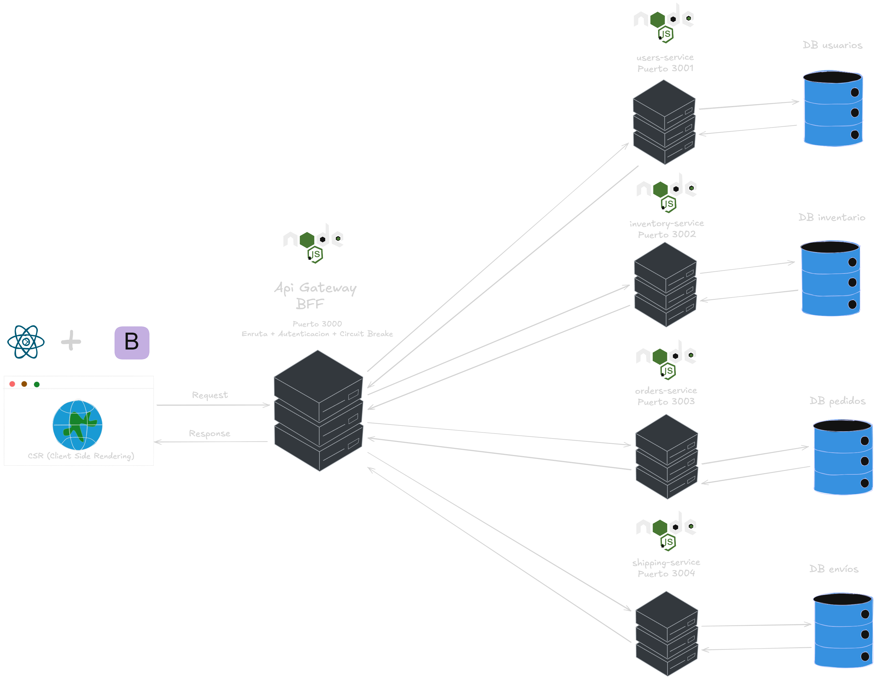

# SmartLogix — Backend Ecosystem

Plataforma integral de gestión logística para PYMEs, construida sobre una **arquitectura de microservicios** con un **BFF (Backend For Frontend)** como punto de entrada único. Reemplaza el sistema monolítico MicroSmart, eliminando los cuellos de botella de sincronización y habilitando escalado horizontal independiente por servicio.

---

## Diagrama de Arquitectura



> El frontend React (CSR) se comunica exclusivamente con el BFF en el puerto 3000. El BFF orquesta las llamadas hacia los cuatro microservicios internos, cada uno con su propia base de datos aislada.

---

## Descripción del Proyecto

SmartLogix resuelve cuatro dominios de negocio críticos para la operación logística de una PYME:

| Dominio               | Responsabilidad                                                        |
|-----------------------|------------------------------------------------------------------------|
| **Identidad**         | Control de acceso con roles, autenticación JWT y gestión de usuarios   |
| **Inventario**        | Registro de almacenes, tipos de producto, ítems y control de stock     |
| **Órdenes**           | Creación atómica de pedidos multi-producto con descuento de stock      |
| **Despachos**         | Coordinación del flujo logístico desde preparación hasta entrega final |

**Stack tecnológico:** NestJS · TypeScript · TypeORM · PostgreSQL · Express.js · Mongoose · MongoDB Atlas · JWT · Circuit Breaker (opossum) · Swagger · Docker

---

## Estructura del Monorepo

```
smartLogix-backend/
├── apps/
│   ├── bff/             # API Gateway / BFF — Puerto 3000
│   ├── ms-users/        # Microservicio de Usuarios — Puerto 3001
│   ├── ms-inventory/    # Microservicio de Inventario — Puerto 3002
│   ├── ms-orders/       # Microservicio de Órdenes — Puerto 3003
│   └── ms-shipping/     # Microservicio de Despachos — Puerto 3004
├── database/            # Scripts de respaldo SQL
├── docker/
│   └── docker-compose.yml
└── docs/
    └── arquitectura-EV3.png
```

---

## Componentes y sus READMEs

| Servicio | Puerto | DB | README |
|---|---|---|---|
| **BFF (API Gateway)** | 3000 | — | [apps/bff/README.md](apps/bff/README.md) |
| **MS-Users** | 3001 | PostgreSQL :5432 | [apps/ms-users/README.md](apps/ms-users/README.md) |
| **MS-Inventory** | 3002 | PostgreSQL :5433 | [apps/ms-inventory/README.md](apps/ms-inventory/README.md) |
| **MS-Orders** | 3003 | PostgreSQL :5434 | [apps/ms-orders/README.md](apps/ms-orders/README.md) |
| **MS-Shipping** | 3004 | MongoDB Atlas | [apps/ms-shipping/README.md](apps/ms-shipping/README.md) |

---

## Prerrequisitos

- [Docker Desktop](https://www.docker.com/products/docker-desktop/) — activo y corriendo
- [Node.js v18+](https://nodejs.org/)
- [Git](https://git-scm.com/)

---

## Guía de Orquestación

El sistema debe levantarse en este orden estricto: **bases de datos → microservicios → BFF**.

### Paso 1 — Levantar las bases de datos (Docker)

Los tres contenedores PostgreSQL se inicializan automáticamente con sus esquemas y datos semilla (`init.sql`).

**Siempre ejecutar desde la raíz del proyecto** (donde está el `package.json`):

```bash
# Levantar los tres contenedores en segundo plano
docker compose -f docker/docker-compose.yml up -d
```

```bash
# Verificar que los tres contenedores están corriendo
docker ps
```

Deberías ver los tres contenedores activos:
- `smartlogix-users-db` → PostgreSQL en puerto `5432`
- `smartlogix-inventory-db` → PostgreSQL en puerto `5433`
- `smartlogix-orders-db` → PostgreSQL en puerto `5434`

> MongoDB Atlas (ms-shipping) es un servicio cloud — no requiere Docker local.

#### Comandos útiles de Docker

```bash
# Pausar sin borrar datos
docker compose -f docker/docker-compose.yml stop

# Detener y eliminar contenedores (mantiene los volúmenes de datos)
docker compose -f docker/docker-compose.yml down

# Reset total — borra volúmenes y recarga datos semilla de fábrica
docker compose -f docker/docker-compose.yml down -v
docker compose -f docker/docker-compose.yml up -d
```

---

### Paso 2 — Instalar dependencias Node

```bash
npm install
```

---

### Paso 3 — Levantar los microservicios

Abre una terminal separada por cada servicio y levántalos en este orden:

```bash
# Terminal 1 — Usuarios (depende de users-db)
npm run dev:users
```

```bash
# Terminal 2 — Inventario (depende de inventory-db)
npm run dev:inventory
```

```bash
# Terminal 3 — Órdenes (depende de orders-db y consulta ms-inventory)
npm run dev:orders
```

```bash
# Terminal 4 — Despachos (depende de MongoDB Atlas)
npm run dev:shipping
```

---

### Paso 4 — Levantar el BFF

Una vez que los cuatro microservicios estén respondiendo:

```bash
# Terminal 5 — BFF (orquesta todos los microservicios)
npm run dev:bff
```

El sistema queda operativo en:
- **API Gateway (BFF):** `http://localhost:3000`
- **Swagger UI:** `http://localhost:3000/docs`

---

## Tabla de Credenciales del Entorno Local

| Servicio | Puerto App | Puerto DB | Base de datos | Usuario DB | Contraseña DB |
|---|---|---|---|---|---|
| BFF | 3000 | — | — | — | — |
| MS-Users | 3001 | 5432 | `smartlogix_users` | `users_user` | `users_password` |
| MS-Inventory | 3002 | 5433 | `smartlogix_inventory` | `inventory_user` | `inventory_password` |
| MS-Orders | 3003 | 5434 | `smartlogix_orders` | `orders_user` | `orders_password` |
| MS-Shipping | 3004 | Atlas | MongoDB Atlas | Ver `api.js` | Ver `api.js` |

> **Aviso académico:** Las credenciales están versionadas en este repositorio con fines educativos y de agilidad en entornos de desarrollo compartido. No reutilizar en producción.
